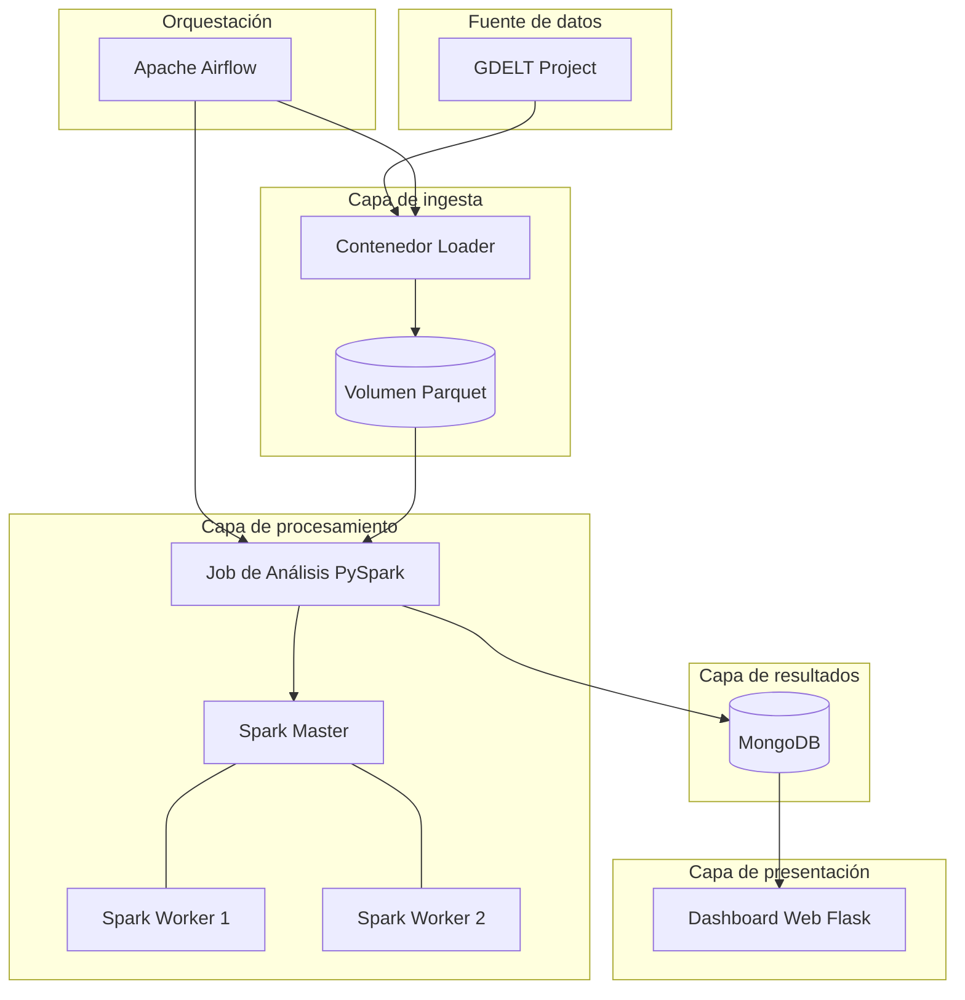
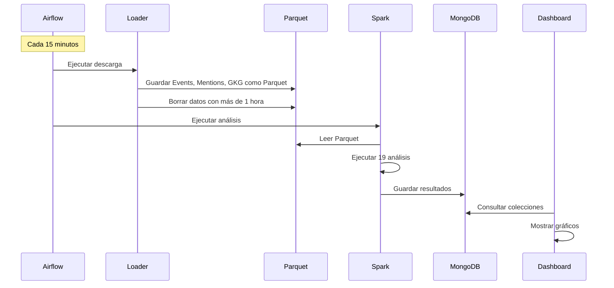

# Documentación del Proyecto — Análisis de Eventos Mundiales (GDELT)

**Curso:** Bases de Datos II — TEC 2026  
**Proyecto:** Pipeline de análisis de datos en contenedores

---

## 1. ¿De qué trata este proyecto?

Este proyecto construye un **sistema automático** que:

1. Descarga noticias y eventos del mundo cada 15 minutos desde **GDELT** (Global Database of Events, Language, and Tone).
2. Guarda esos datos en un formato eficiente (**Parquet**).
3. Los analiza con **Apache Spark** (procesamiento distribuido).
4. Guarda solo los **resultados finales** en **MongoDB**.
5. Muestra esos resultados en un **dashboard web**.

En pocas palabras: tomamos datos crudos de noticias globales, los procesamos, y mostramos estadísticas listas para consultar, sin que el usuario tenga que calcular nada en tiempo real.

---

## 2. Arquitectura de la solución

La solución está dividida en **capas**, cada una en su propio contenedor Docker.



### 2.1 Contenedores y su función

| Contenedor | Tecnología | ¿Qué hace? |
|------------|------------|------------|
| `gdelt-loader` | Python 3.11 | Descarga archivos GDELT cada 15 min y los convierte a Parquet |
| `gdelt-spark-master` | Apache Spark 3.5 | Coordina el trabajo de análisis entre workers |
| `gdelt-spark-worker-1` | Apache Spark 3.5 | Ejecuta tareas de procesamiento (nodo 1) |
| `gdelt-spark-worker-2` | Apache Spark 3.5 | Ejecuta tareas de procesamiento (nodo 2) |
| `gdelt-spark-analysis` | PySpark | Corre los 19 análisis y escribe en MongoDB |
| `gdelt-mongo` | MongoDB 7 | Almacena resultados ya calculados |
| `gdelt-dashboard` | Flask | Página web que muestra gráficos y tablas |
| `gdelt-airflow-web` | Apache Airflow 2.8 | Interfaz para ver y controlar el pipeline |
| `gdelt-airflow-scheduler` | Apache Airflow 2.8 | Programa la ejecución automática cada 15 min |
| `gdelt-postgres` | PostgreSQL 15 | Base de datos interna de Airflow (no guarda datos GDELT) |

### 2.2 ¿Por qué contenedores?

Usamos Docker porque el enunciado lo pide y porque cada herramienta tiene dependencias distintas. Con contenedores no hay que instalar todo manualmente y todos pueden correr el mismo entorno.

---

## 3. Diseño de flujo (pipeline)

### 3.1 Flujo general (ETL)

```
EXTRACT  →  TRANSFORM  →  LOAD  →  VISUALIZE
(GDELT)      (Spark)       (MongoDB)  (Dashboard)
```

### 3.2 Flujo detallado



### 3.3 Flujo del Loader

1. Calcula los últimos 4 intervalos de 15 minutos (UTC).
2. Descarga de GDELT:
   - `YYYYMMDDHHMMSS.export.CSV.zip` → Events
   - `YYYYMMDDHHMMSS.mentions.CSV.zip` → Mentions
   - `YYYYMMDDHHMMSS.gkg.csv.zip` → GKG
3. Descomprime, asigna columnas y convierte a Parquet.
4. Guarda en `/data/parquet/<tabla>/ts=<timestamp>/data.parquet`
5. Elimina particiones con más de 1 hora.

> No descargamos todo el histórico (más de 2.5 TB). Solo archivos recientes de 15 minutos.

### 3.4 Flujo del análisis Spark

1. Lee Parquet del volumen compartido.
2. Ejecuta los 19 análisis.
3. Escribe resultados en MongoDB (sobrescribe colecciones).
4. Registra última ejecución en `pipeline_metadata`.

### 3.5 Flujo del dashboard

1. Usuario abre `http://localhost:5000`.
2. Flask sirve HTML con pestañas.
3. JavaScript consulta `/api/<colección>`.
4. Chart.js dibuja gráficos con datos de MongoDB.

---

## 4. Diseño de bases de datos

### 4.1 Parquet (datos intermedios)

**Ubicación:** volumen Docker `gdelt-analytics_parquet_data`  
**Ruta:** `/data/parquet`

```
/data/parquet/
├── events/ts=YYYYMMDDHHMMSS/data.parquet
├── mentions/ts=YYYYMMDDHHMMSS/data.parquet
└── gkg/ts=YYYYMMDDHHMMSS/data.parquet
```

| Aspecto | Decisión |
|---------|----------|
| Formato | Parquet (alternativa a HDFS del enunciado) |
| Particionado | Por timestamp de carga |
| Retención | 1 hora |
| Escritura | Loader |
| Lectura | Spark |

**Tablas principales:**
- **events** (61 columnas): actores, ubicación, CAMEO, GoldsteinScale, AvgTone, NumMentions...
- **mentions** (16 columnas): menciones de eventos en artículos.
- **gkg** (27 columnas): temas, organizaciones, personas del texto.

### 4.2 MongoDB (resultados finales)

**Base de datos:** `gdelt_analytics`  
Solo guarda **estadísticas ya calculadas**, no datos crudos.

#### Colecciones

| Colección | Contenido |
|-----------|-----------|
| `conflict_heatmap` | Intensidad de conflictos por país/día (Goldstein) |
| `top_countries_events` | Top 10 países con más eventos por día |
| `tone_sources_correlation` | Correlación AvgTone vs NumSources |
| `cameo_by_region` | Tipos CAMEO por región |
| `actor_interaction_matrix` | Matriz gobierno vs militar vs rebeldes |
| `media_coverage` | Cobertura mediática (menciones/evento) |
| `sentiment_trend` | Sentimiento con promedio móvil 7 días |
| `conflict_country_pairs` | Pares de países en conflicto |
| `escalation_events` | Escalada de menciones en 24h |
| `religion_conflict_clusters` | Conflictos por religión y región |
| `gkg_themes_by_continent` | Temas GKG por continente/año |
| `top_organizations` | Organizaciones más mencionadas |
| `tone_lag_analysis` | Tono hoy → conflictos mañana |
| `diplomatic_conflict_graph` | Diplomático vs conflicto entre países |
| `source_diversity_index` | Diversidad de medios por país |
| `ethnic_conflict_frequency` | Conflictos por etnia |
| `breaking_news` | 0 → 100+ menciones en menos de 1 hora |
| `quadclass_timeline` | Evolución QuadClass por región *(extra)* |
| `hourly_event_density` | Eventos por hora UTC *(extra)* |
| `pipeline_metadata` | Control del pipeline (última ejecución) |

#### Índices

- `conflict_heatmap`: `(event_date, country_code)`
- `top_countries_events`: `(event_date, rank)`
- `sentiment_trend`: `(country_code, event_date)`
- `top_organizations`: `(event_date, rank)`
- `pipeline_metadata`: `(last_run)` descendente

#### Usuarios

| Usuario | Contraseña | Rol |
|---------|------------|-----|
| `admin` | `gdelt2026` | Administrador |
| `gdelt_user` | `gdelt_read` | Lectura/escritura en `gdelt_analytics` |

### 4.3 PostgreSQL (solo Airflow)

Guarda metadatos internos de Airflow (DAGs, historial de ejecuciones). **No contiene datos de GDELT.**

---

## 5. Tecnologías utilizadas

| Tecnología | Uso |
|------------|-----|
| Docker / Docker Compose | Contenedores y orquestación |
| Python 3.11 | Loader y dashboard |
| Pandas + PyArrow | CSV → Parquet |
| Apache Spark 3.5 | Análisis distribuido |
| PySpark | Scripts de análisis |
| MongoDB 7 | Resultados finales (NoSQL) |
| Apache Airflow 2.8 | Pipeline cada 15 minutos |
| PostgreSQL 15 | Metadatos de Airflow |
| Flask 3.x | Servidor web del dashboard |
| Chart.js 4.4 | Gráficos en el navegador |
| GDELT 2.0 | Fuente de datos |

**¿Por qué Parquet y no HDFS?** El enunciado permite ambos. Parquet en volumen Docker es más simple para desarrollo en laptop.

**¿Por qué MongoDB?** Cada análisis tiene estructura distinta; documentos JSON se adaptan bien sin 19 tablas relacionales.

---

## 6. Orquestación con Airflow

Cada 15 minutos ejecuta el DAG `gdelt_pipeline`:

```
gdelt_loader (descargar)  →  spark_analysis (analizar y guardar)
```

Cada tarea lanza un contenedor temporal con el volumen Parquet montado y conectado a la red del proyecto.

**UI:** `http://localhost:8081` (admin / admin)

---

## 7. Dashboard (visualización)

| Pestaña | Contenido |
|---------|-----------|
| Resumen | Conteos y gráficos generales |
| Conflictos | Goldstein, pares de países, etnias, religión |
| Medios | Tono, cobertura, breaking news |
| Actores | Matriz de actores, grafo diplomático, CAMEO |
| GKG | Temas y organizaciones |
| Avanzado | Rezago tonal, densidad horaria |
| Conclusiones | 3 conclusiones del equipo |

**API:** `GET /api/<colección>` y `GET /api/summary`

---

## 8. Uso de inteligencia artificial

**Transparencia:** Se utilizó asistencia de IA, **principalmente en el visualizador de información**.

| Componente | ¿IA? |
|------------|------|
| Loader | No / mínimo |
| Análisis Spark | No / mínimo |
| Diseño MongoDB | No / mínimo |
| Docker / Airflow | No / mínimo |
| **Dashboard (HTML, CSS, JS, Flask)** | **Sí, principalmente** |
| Esta documentación | Parcial |

La IA **no analiza los datos de GDELT**. Solo ayudó a construir la interfaz que muestra los resultados de Spark.

---

## 9. Cómo ejecutar

```bash
docker compose up -d --build
docker compose exec loader python loader.py --once
docker compose --profile manual run --rm spark-analysis
```

- Dashboard: http://localhost:5000
- Airflow: http://localhost:8081
- Spark UI: http://localhost:8080

---

## 10. Conclusiones del análisis

1. **Concentración geográfica:** Los conflictos de mayor intensidad se concentran en Medio Oriente, África y Asia, con pares de países que se repiten en el tiempo.

2. **Cobertura mediática desigual:** Países occidentales tienen más diversidad de fuentes. La correlación entre tono y número de medios es débil.

3. **Detección temprana:** Escalada de menciones y breaking news permiten identificar crisis antes de que escalen a conflictos materiales.

---

## 11. Estructura del repositorio

```
proyecto 2/
├── DOCUMENTACION.md        ← Este archivo
├── README.md               ← Guía rápida
├── docker-compose.yml
├── loader/                 ← Descarga GDELT → Parquet
├── spark/                  ← 19 análisis PySpark
├── airflow/dags/           ← Pipeline programado
├── mongo/init.js           ← Esquema MongoDB
├── dashboard/              ← Visualización web
└── scripts/e2e_test.ps1    ← Prueba del pipeline
```

---

## 12. Referencias

- [GDELT Project](https://www.gdeltproject.org/)
- [GDELT Event Codebook](http://data.gdeltproject.org/documentation/GDELT-Event_Codebook-V2.0.pdf)
- [Apache Spark](https://spark.apache.org/docs/latest/)
- [MongoDB](https://www.mongodb.com/docs/)
- [Apache Airflow](https://airflow.apache.org/docs/)
